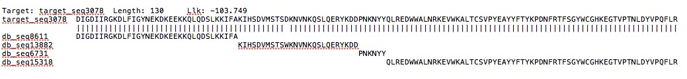

```{r setup, include=FALSE}
knitr::opts_chunk$set(echo = TRUE)
```


In the past, I only calculated the difference between each pair of consistent source intervals per target sequence to check whether there is horizontal jumps (results are in db_relative_distance.Rmd). In the following, I will take the breakpoint position of target sequence into account, and see whether it only jumps to limited positions of source sequences.

I use the Ghana pilot dataset to explore the answer.


```{r}
library(data.table)
library(readr)
db_ghana <- fread("/Users/fengqian/Downloads/UniMelb_shared-master/project/mosaic_data/db_jumps_proportions_analysis.txt" , header=FALSE, data.table = FALSE)
db <- apply(as.matrix(db_ghana)[,2:3],2, as.numeric)
rownames(db) <- as.matrix(db_ghana)[,1]

target_bkp <- read_lines("/Users/fengqian/Downloads/UniMelb_shared-master/project/mosaic_data/target_jumps_proportions.csv")
```


Detailed calculation process is shown below.
Let's take seq 3078 as an example. According to its mosaic alignment, there are four source segments in total, we not only extract the relative starting and ending position for each source segment, also list all the target sequence's breakpoint positions.



```{r echo=FALSE}
cat("relative locations for each source segment","\n")
db[which(rownames(db)=="seq3078"),]
cat("\n","bkp positions of target sequence","\n")
temp=str_split(target_bkp[11], ",")[[1]][-5];as.numeric(temp[-1])
```


I will compute  (1) 0.276923077-0.2692307692307692; (2) 0.392857143-0.46923076923076923; (3) 0.483333333-0.5153846153846153.

Besides, same with before, single-site source segments are excluded to reduce the errors.


```{r}
difference=NULL
for (i in 1:length(target_bkp)){
  temp=str_split(target_bkp[i], ",")[[1]]
  target_name=temp[1]
  bkp_pro=as.numeric(temp[-1])
  if (length(bkp_pro)>1){
    bkp_pro_final=bkp_pro[-length(bkp_pro)]
    block <- db[rownames(db)==target_name,]
    source_final=block[-1,1]
    index=which(block[-1,2]-block[-1,1]==0)
    diff=as.numeric((source_final-bkp_pro_final)[-index])
    difference=c(difference,diff)
  }
}
```


```{r}
summary(difference)
summary(difference*125)

hist(difference,xlab="Difference",breaks=seq(-1,1,0.025),col="grey",border="black", xaxt='n',main="")
axis(side=1, at=seq(-1,1,0.05))
```

```{r}
pdf(file="target_db_difference_ghana.pdf")
ggplot() + aes(as.numeric(difference))+ geom_histogram(binwidth=0.05, col=I("black"),fill=I("black"), alpha=I(.4))+xlab("Normalized distance")+ylab("Frequency")+scale_y_continuous(expand = c(0, 0),breaks=seq(0,3000,500),limits=c(0,3000))+scale_x_continuous(breaks=seq(-0.2,0.2,0.05),limits=c(-0.2,0.2))+theme_bw()+theme(axis.text.x = element_text(colour ="black",size=18),axis.text.y = element_text(colour ="black",size=18),axis.title.y = element_text(size = 23,margin = unit(c(0, 4, 0, 0), "mm")),axis.title.x = element_text(size = 23,margin = unit(c(4, 0, 0, 0), "mm")))+ theme(panel.grid.major = element_blank(),panel.grid.minor = element_blank(),panel.border = element_rect(colour = "black",size=1))
dev.off()
```

